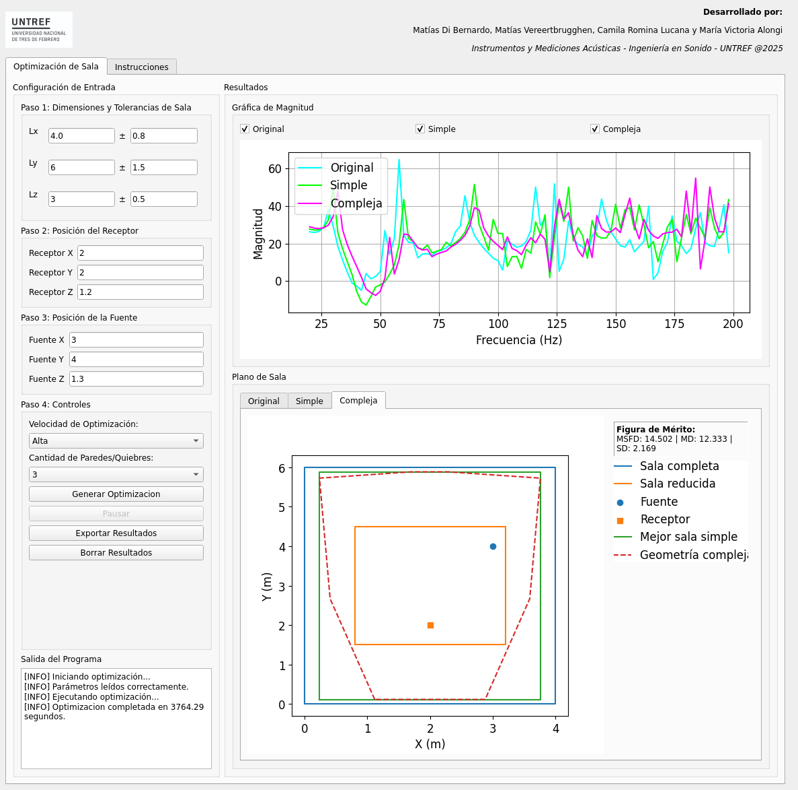

# Acoustic Modal Response Optimizer

## Descripción

Esta aplicación permite optimizar de forma automática la distribución modal en salas de control acústico. Se utiliza el método por elemenots finitos (FD-FEM) para obtener la respuesta en frecuencia de salas con diferentes geometrías y se optimiza por fuerza bruta para encontrar la sala con mejor respuesta en magnitud y en el espacio. 

---

## Captura de pantalla de la interfaz



*Figura 1. Interfaz gráfica de la herramienta.*

---

## Requisitos

- **Sistema operativo:** Linux (nativo) o Windows (con WSL).
- **Python:** versión 3.8 o superior.
- **Dependencias:** se instalan automáticamente con el script `install.sh` (incluye FEniCS, PyQt5 y demás librerías necesarias).

---

## Instalación y Ejecución

1. Clonar el repositorio:
   ```bash
   git clone https://github.com/MatiasDiBernardo/Acoustic-Modal-Response-Optimizer.git
   cd Acoustic-Modal-Response-Optimizer
   ```
2. Instalar las dependencias
   ```bash
    chmod +x install.sh
    ./install.sh
   ```
3. Ejecutar la aplicación
   ```bash
    python3 main.py
   ```

Se recomienda tener un entorno nuevo antes de comenzar con el proceso de instalación para evitar conflictos inesperados.
El código se parte del artículo ...
